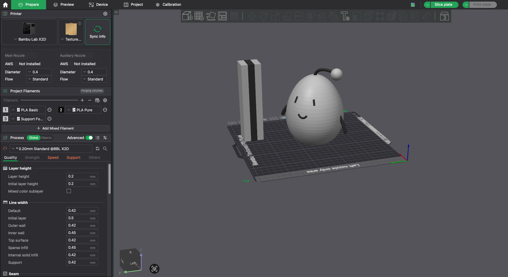
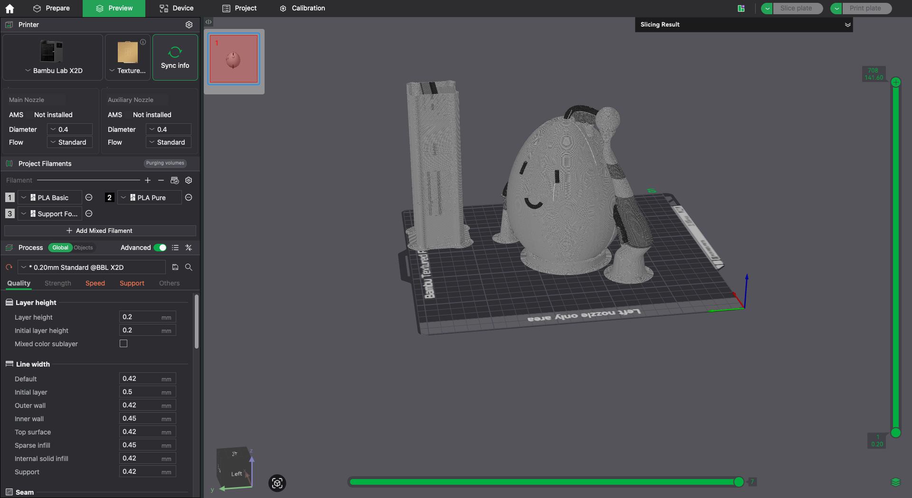

My graduate school has a very cute mascot character named [Isty-kun](https://www.i.u-tokyo.ac.jp/isty_e.shtml).
His name comes from **I**nformation **S**cience and **T**echnolog**y**, and he is a small robot who protects safety and security in the information society.

{style="max-width: 300px; margin-inline: auto;"}

I liked him so much that I decided to recreate him in Blender and bring him into the real world with a 3D printer.
This was a purely personal project, made just for fun.

## Modeling in Blender

The whole character is built from two kinds of objects: one solid body, and a set of curves that provide every line.
His structure is simple enough that putting him together in Blender took almost no time.

Here is the exported model, embedded directly into this page.
Drag to rotate him, and scroll to zoom. \
**See how cute he is!**



## Slicing in Bambu Studio

Once the shapes were finished, I exported the whole scene as a single OBJ file and opened it in [Bambu Studio](https://bambulab.com/en/download/studio), the slicer for my [Bambu Lab X2D](https://store.bambulab.com/products/x2d).
Bambu Studio was easy to install, and it sliced him with almost no configuration from me.

The part I was worried about was his floating antenna, which has nothing underneath it to rest on.
In the end I did not have to do anything: the slicer found the overhangs by itself and generated supports under the antenna and under both arms.

## Printing

The X2D has a built-in camera, so the print recorded itself.



## Closing thoughts

I am really happy that he now exists in the physical world.
What surprised me most was how little friction there was along the way: designing a personal object and actually holding it in my hand turned out to be easy from end to end.
3D printers are not that expensive anymore, so I am starting to think that I want one of my own someday.

Photo-based 3D reconstruction and diffusion-based generative models are both moving quickly right now.
Between tools like those and a printer sitting on your desk, it feels like we are getting close to being able to build whatever we can imagine.
